# Kamper

[](LICENSE)
[](https://github.com/smellouk/kamper/releases)
[](https://github.com/smellouk/kamper/issues)
[](https://github.com/smellouk/kamper/stargazers)

**Kotlin Multiplatform performance monitoring.** A plugin-based library that gives you live CPU, FPS, memory, network, jank, GC, thermal, and issue detection across Android, iOS, JVM, macOS, and Web — through a single unified API.


### Highlights

- **Zero-boilerplate** — one `install()` call per module
- **Kamper UI** — floating debug overlay for Android, auto-enabled in debug builds, zero app code required
- **8 modules** — CPU, FPS, Memory, Network, Jank, GC, Thermal, Issues
- **Multiplatform** — Android, iOS, JVM, macOS, Web (JS + Wasm)
- **Perfetto export** — record a session and open it at [ui.perfetto.dev](https://ui.perfetto.dev) with one tap

<br clear="right"/>

---

## Kamper UI

A floating chip overlay that sits over any screen and shows live performance metrics. Tap to expand, tap again to open the full panel. Drag to either edge — it snaps flush with no extra rounded corner on the anchored side. Shake the device to restore a collapsed chip.

**Android: zero app code required.** A `ContentProvider` auto-initialises the overlay in debug builds and disables it automatically in release.

**iOS: one line in `AppDelegate`.** The chip uses `ComposeUIViewController` as a UIKit child view, drag-and-snap works via touch, and shake detection uses `CMMotionManager`.

<p align="center">
  
</p>

### Panel tabs

<table>
  <tr>
    <td align="center"><b>Activity</b></td>
    <td align="center"><b>Perfetto</b></td>
    <td align="center"><b>Issues</b></td>
    <td align="center"><b>Settings</b></td>
  </tr>
  <tr>
    <td>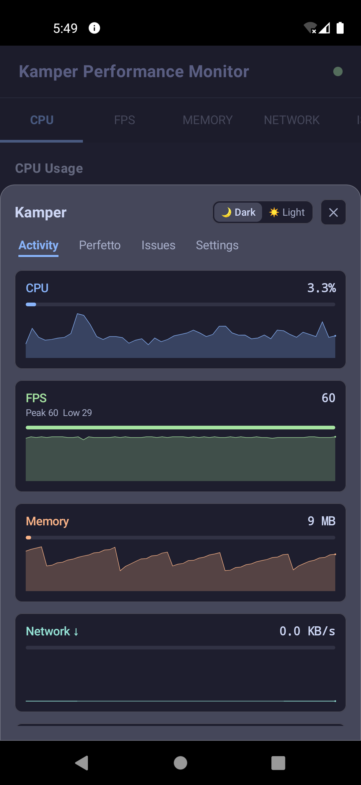</td>
    <td>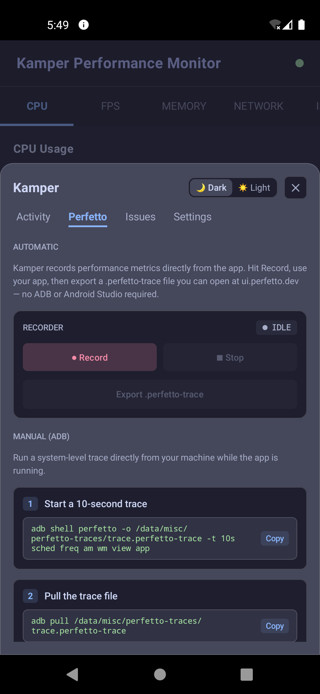</td>
    <td>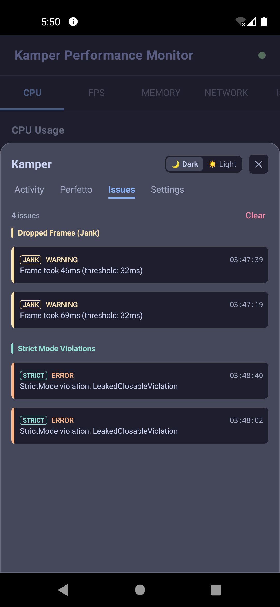</td>
    <td>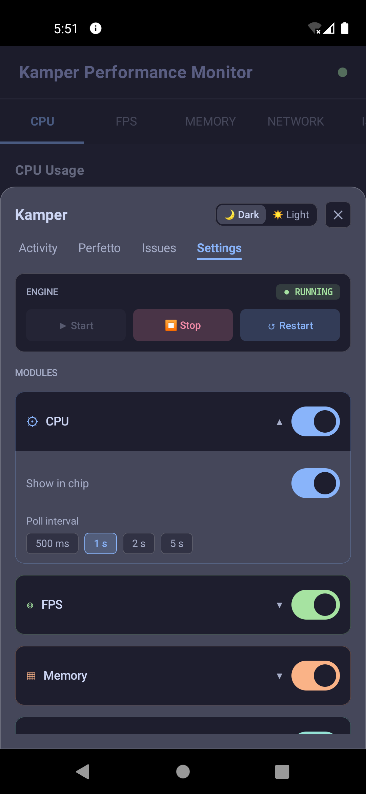</td>
  </tr>
</table>

### Chip states

<table>
  <tr>
    <td align="center">Peek (default)</td>
    <td align="center">Expanded — core metrics</td>
    <td align="center">Expanded — all metrics</td>
  </tr>
  <tr>
    <td>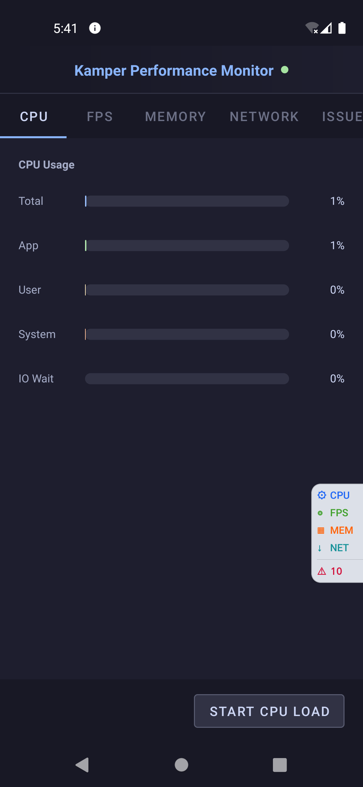</td>
    <td>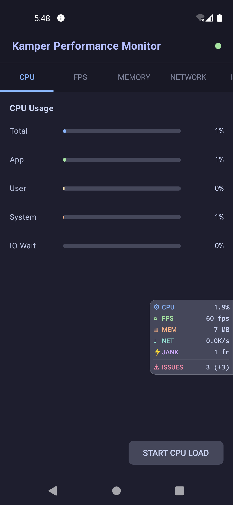</td>
    <td>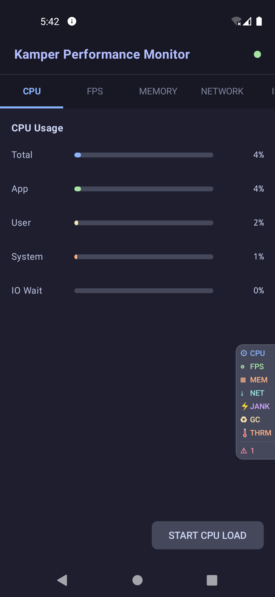</td>
  </tr>
</table>

---

## Platform support

| Module   | Android | iOS | JVM | macOS | Web |
|----------|:-------:|:---:|:---:|:-----:|:---:|
| CPU      | ✅ | ✅ | ✅ | ✅ | ✅ |
| FPS      | ✅ | ✅ | ✅ | ✅ | ✅ |
| Memory   | ✅ | ✅ | ✅ | ✅ | ✅¹ |
| Network  | ✅² | ✅ | ✅ | ✅ | ✅³ |
| Jank     | ✅ | ❌ | ✅ | ❌ | ❌ |
| GC       | ✅ | ❌ | ✅ | ❌ | ❌ |
| Thermal  | ✅ | ❌ | ❌ | ❌ | ❌ |
| Issues   | ✅ | ❌ | ✅ | ❌ | ❌ |
| Kamper UI| ✅ | ✅⁴ | ❌ | ❌ | ❌ |

> ¹ Heap metrics via `performance.memory` (Chromium-based browsers only).  
> ² Full support requires API 23+. API 16–22 reports system-level traffic only.  
> ³ Bandwidth estimate via the [Network Information API](https://developer.mozilla.org/en-US/docs/Web/API/NetworkInformation) (Chrome / Edge).  
> ⁴ Requires `KamperUi.attach()` in `AppDelegate` — no auto-init on iOS.

---

## Installation

Add the GitHub Packages repository, then pull the engine and whichever modules you need:

```kotlin
repositories {
    maven("https://maven.pkg.github.com/smellouk/kamper")
}

dependencies {
    val kamperVersion = "<latest-version>"

    implementation("com.smellouk.kamper:engine:$kamperVersion")

    // Core metrics
    implementation("com.smellouk.kamper:cpu-module:$kamperVersion")
    implementation("com.smellouk.kamper:fps-module:$kamperVersion")
    implementation("com.smellouk.kamper:memory-module:$kamperVersion")
    implementation("com.smellouk.kamper:network-module:$kamperVersion")

    // Advanced metrics
    implementation("com.smellouk.kamper:jank-module:$kamperVersion")
    implementation("com.smellouk.kamper:gc-module:$kamperVersion")
    implementation("com.smellouk.kamper:thermal-module:$kamperVersion")
    implementation("com.smellouk.kamper:issues-module:$kamperVersion")

    // Android debug overlay (auto-init, no code required)
    debugImplementation("com.smellouk.kamper:ui-android:$kamperVersion")
}
```

---

## Quick start

```kotlin
Kamper.setup {
    logger = Logger.DEFAULT   // swap for Logger.EMPTY in production
}.apply {
    install(CpuModule)
    install(FpsModule)
    install(MemoryModule())
    install(NetworkModule)
    install(JankModule)
    install(GcModule)
    install(ThermalModule)
    install(IssuesModule())

    addInfoListener<CpuInfo>     { info -> /* update UI / analytics */ }
    addInfoListener<FpsInfo>     { info -> /* update UI / analytics */ }
    addInfoListener<MemoryInfo>  { info -> /* update UI / analytics */ }
    addInfoListener<NetworkInfo> { info -> /* update UI / analytics */ }
    addInfoListener<JankInfo>    { info -> /* dropped frame alerts   */ }
    addInfoListener<GcInfo>      { info -> /* GC pressure tracking   */ }
    addInfoListener<ThermalInfo> { info -> /* thermal throttling     */ }
    addInfoListener<IssueInfo>   { info -> /* ANR / crash / slow UI  */ }

    start()
}
```

On **Android**, attach Kamper to the lifecycle for automatic `start` / `stop` / `clear`:

```kotlin
class MainActivity : AppCompatActivity() {
    override fun onCreate(savedInstanceState: Bundle?) {
        super.onCreate(savedInstanceState)
        lifecycle.addObserver(Kamper)
    }
}
```

---

## Modules

<details>
<summary><strong>CPU</strong> — total, user, system, and app CPU ratios</summary>

```kotlin
install(
    CpuModule {
        isEnabled    = true
        intervalInMs = 1_000
    }
)

addInfoListener<CpuInfo> { info ->
    if (info == CpuInfo.INVALID) return@addInfoListener
    println("Total: ${"%.1f".format(info.totalUseRatio * 100)}%")
    println("App:   ${"%.1f".format(info.appRatio * 100)}%")
}
```
</details>

<details>
<summary><strong>FPS</strong> — frames per second via platform frame-timing APIs</summary>

```kotlin
install(FpsModule)

addInfoListener<FpsInfo> { info ->
    if (info != FpsInfo.INVALID) println("FPS: ${info.fps}")
}
```
</details>

<details>
<summary><strong>Memory</strong> — heap usage, PSS (Android), and available RAM</summary>

```kotlin
install(MemoryModule())

addInfoListener<MemoryInfo> { info ->
    if (info == MemoryInfo.INVALID) return@addInfoListener
    println("Heap used: ${info.heapMemoryInfo.allocatedInMb} MB")
    println("RAM free:  ${info.ramInfo.availableRamInMb} MB")
}
```
</details>

<details>
<summary><strong>Network</strong> — bytes received / transmitted per interval</summary>

```kotlin
install(NetworkModule {
    intervalInMs = 1_000
})

addInfoListener<NetworkInfo> { info ->
    if (info == NetworkInfo.INVALID || info == NetworkInfo.NOT_SUPPORTED) return@addInfoListener
    println("↓ ${info.rxSystemTotalInMb} MB  ↑ ${info.txSystemTotalInMb} MB")
}
```
</details>

<details>
<summary><strong>Jank</strong> — dropped frames and slow renders (Android + JVM)</summary>

```kotlin
install(JankModule {
    frameThresholdMs          = 32   // flag frames slower than this
    consecutiveFrameThreshold = 3    // after N consecutive slow frames
})

addInfoListener<JankInfo> { info ->
    if (info == JankInfo.INVALID) return@addInfoListener
    println("Dropped frames: ${info.droppedFrames}")
}
```
</details>

<details>
<summary><strong>GC</strong> — garbage collection runs and pause time (Android + JVM)</summary>

```kotlin
install(GcModule)

addInfoListener<GcInfo> { info ->
    if (info == GcInfo.INVALID) return@addInfoListener
    println("GC runs: +${info.countDelta}  Pause: +${info.pauseMsDelta} ms")
}
```
</details>

<details>
<summary><strong>Thermal</strong> — device thermal state and throttling (Android)</summary>

```kotlin
install(ThermalModule)

addInfoListener<ThermalInfo> { info ->
    if (info == ThermalInfo.INVALID) return@addInfoListener
    println("Thermal: ${info.state}  Throttling: ${info.isThrottling}")
}
```
</details>

<details>
<summary><strong>Issues</strong> — ANR, crash, dropped frames, memory pressure, slow start (Android + JVM)</summary>

```kotlin
install(
    IssuesModule(
        context   = context,
        anr       = AnrConfig(isEnabled = true),
        slowStart = SlowStartConfig(isEnabled = true)
    ) {
        slowSpan = SlowSpanConfig(
            isEnabled          = true,
            defaultThresholdMs = 1_000
        )
        droppedFrames = DroppedFramesConfig(
            isEnabled                  = true,
            frameThresholdMs           = 32,
            consecutiveFramesThreshold = 3
        )
        crash          = CrashConfig(isEnabled = true)
        memoryPressure = MemoryPressureConfig(isEnabled = true)
    }
)

addInfoListener<IssueInfo> { info ->
    val issue = info.issue
    println("[${issue.severity}] ${issue.type}: ${issue.message}")
}
```
</details>

---

## Kamper UI — Android debug overlay

**Android** — use `debugImplementation` so it never ships to production:

```kotlin
debugImplementation("com.smellouk.kamper:ui-android:$kamperVersion")
```

The overlay appears automatically in every debug build via a `ContentProvider`. No `Application` or `Activity` code needed. Completely stripped from release builds.

**iOS** — add the framework and call `attach()` once:

```swift
// AppDelegate.swift
import KamperUi

func application(_ application: UIApplication,
                 didFinishLaunchingWithOptions ...) -> Bool {
    KamperUi.shared.attach()
    return true
}
```

### Optional configuration

```kotlin
// In Application.onCreate() or anywhere before first activity launch
KamperUi.configure {
    isEnabled  = true
    position   = ChipPosition.TOP_END  // TOP_START | TOP_END | CENTER_START | CENTER_END | BOTTOM_START | BOTTOM_END
}
```

### Perfetto tracing

The **Perfetto** tab lets you record a session in-app and export a `.perfetto-trace` file directly from the share sheet — no ADB or Android Studio required. Open the file at [ui.perfetto.dev](https://ui.perfetto.dev) to analyse counter tracks for CPU, FPS, Memory, Network, Jank, GC, and Thermal.

---

## Demos

| Demo | Stack | Platform | Screenshot |
|------|-------|----------|------------|
| [`demos/android`](demos/android) | Android Views | Android |  |
| [`demos/compose`](demos/compose) | Compose Multiplatform | Android · Desktop · Web | — |
| [`demos/jvm`](demos/jvm) | Swing | JVM / Desktop | 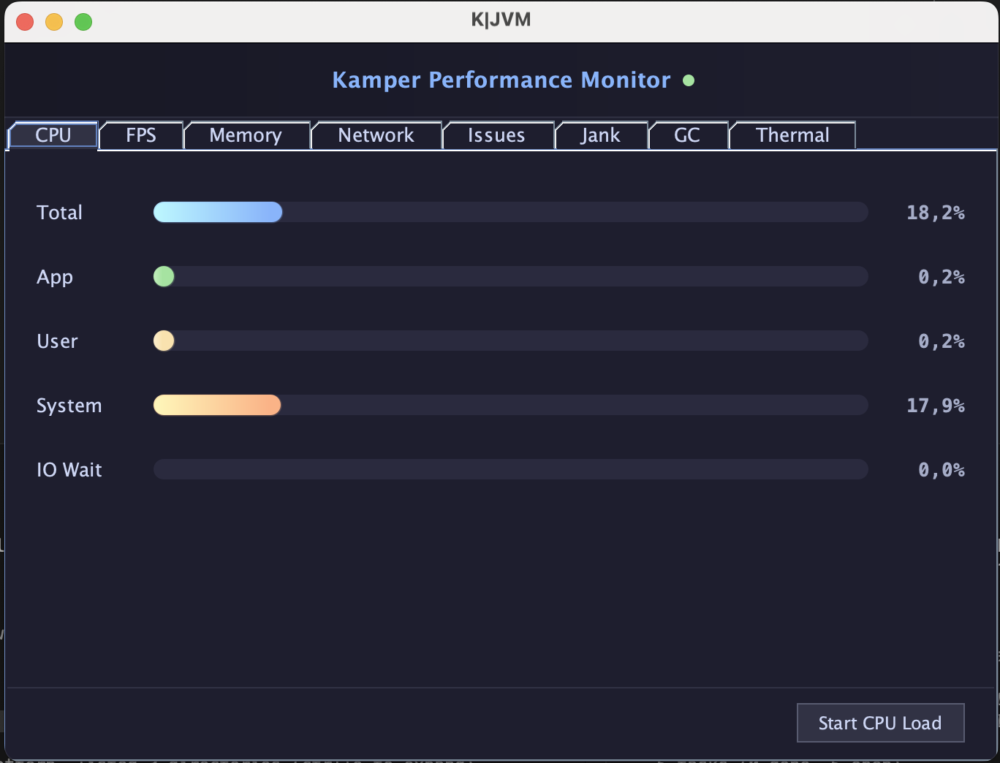 |
| [`demos/macos`](demos/macos) | AppKit (Kotlin/Native) | macOS | 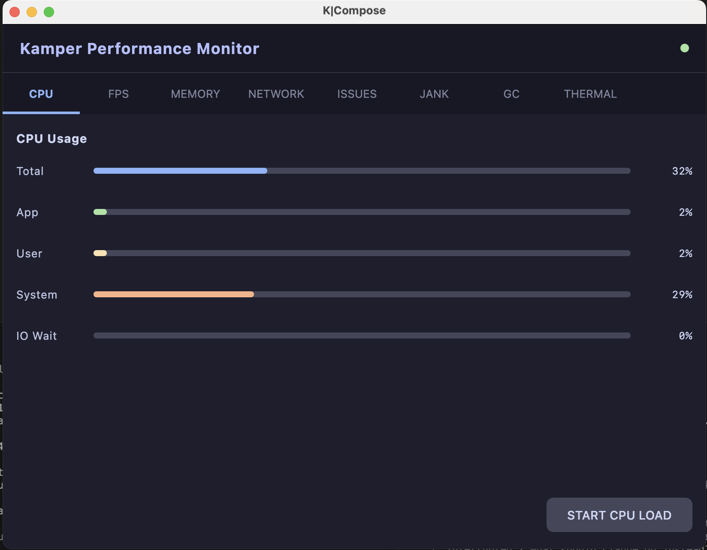 |
| [`demos/ios`](demos/ios) | UIKit (Kotlin/Native) | iOS | 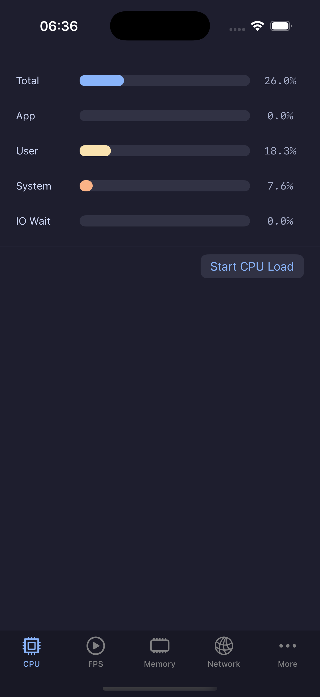 |
| [`demos/web`](demos/web) | Kotlin/JS + DOM | Browser | 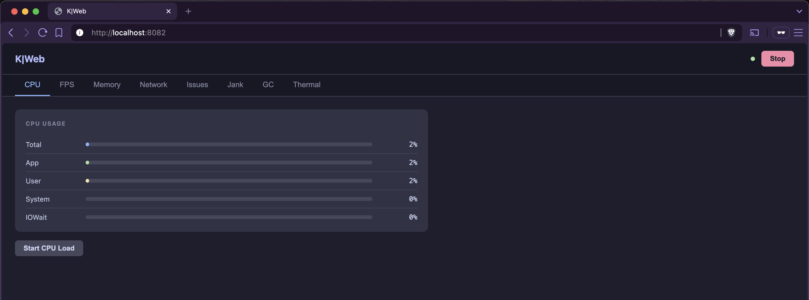 |
| [`demos/react-native`](demos/react-native) | React Native | Android · iOS | — |

---

## Lifecycle

```kotlin
Kamper.start()   // begin polling all installed modules
Kamper.stop()    // pause polling (modules stay installed)
Kamper.clear()   // uninstall all modules and remove all listeners
```

---

## Service Integrations

Kamper can forward metrics and crash events to third-party observability services. Each
integration is a separate artifact — add only the ones you need. Nothing is forwarded unless
you explicitly enable it in the DSL config (all forwarding flags default to `false`).

Use `addIntegration()` on the `Kamper` engine instance to attach an integration module:

```kotlin
Kamper
    .install(CpuModule)
    .install(MemoryModule)
    .addIntegration(SentryModule(dsn = "https://abc123@sentry.io/123456") {
        forwardIssues      = true   // IssueInfo -> Sentry.captureException
        forwardCpuAbove    = 80f    // CPU > 80 % -> Sentry breadcrumb
        forwardMemoryAbove = 85f    // Memory > 85 % -> Sentry breadcrumb
        forwardFps         = false
    })
```

### Sentry

Routes `IssueInfo` events as `Sentry.captureException` and CPU / Memory / FPS metrics as Sentry
breadcrumbs (only when the configured threshold is exceeded).

**Dependency:**

```kotlin
dependencies {
    implementation("com.smellouk.kamper:sentry-integration:$kamperVersion")
}
```

**Supported platforms:** Android, iOS, JVM, macOS (JS and WasmJS excluded — `sentry-kotlin-multiplatform:0.13.0` does not publish JS/WasmJS artifacts).

**DSL options:**

| Option | Type | Default | Description |
|--------|------|---------|-------------|
| `dsn` | `String` | required | Your Sentry project DSN |
| `forwardIssues` | `Boolean` | `false` | Send `IssueInfo` as `captureException` |
| `forwardCpuAbove` | `Float?` | `null` | Send CPU breadcrumb when ratio exceeds this value (0–100) |
| `forwardMemoryAbove` | `Float?` | `null` | Send memory breadcrumb when ratio exceeds this value (0–100) |
| `forwardFps` | `Boolean` | `false` | Send FPS breadcrumb on every poll |

---

### Firebase Crashlytics

Routes `IssueInfo` events as Firebase Crashlytics non-fatal exceptions. CPU, memory, and FPS
are not forwarded — Crashlytics is for error tracking, not performance metrics.

**Dependency:**

```kotlin
dependencies {
    implementation("com.smellouk.kamper:firebase-integration:$kamperVersion")
}
```

**Supported platforms:** Android (real Crashlytics SDK), iOS (NSError wrapping via CocoaPods).
On JVM, macOS, JS, and WasmJS the integration is a no-op — no platform guard is needed in
your code.

> **Note:** Firebase must already be initialised by the host app before Kamper starts.
> On Android this means a valid `google-services.json` and the `com.google.gms.google-services`
> plugin. On iOS this means a valid `GoogleService-Info.plist` loaded at app launch.

**DSL usage:**

```kotlin
Kamper
    .install(IssuesModule())
    .addIntegration(
        FirebaseModule {
            forwardIssues = true  // IssueInfo -> Crashlytics.recordException / recordError
        }
    )
```

---

### OpenTelemetry (Grafana, Datadog, New Relic, Honeycomb, …)

Exports CPU, memory, and FPS metrics as OpenTelemetry gauge measurements over OTLP HTTP.
One OTLP endpoint covers all compatible backends — no need for separate `kamper-grafana`
or `kamper-datadog` artifacts.

**Dependency:**

```kotlin
dependencies {
    implementation("com.smellouk.kamper:opentelemetry-integration:$kamperVersion")
}
```

**Supported platforms:** Android and JVM (real OTLP gauge export via opentelemetry-java 1.51.0).
On iOS, macOS, JS, and WasmJS the integration is a no-op — the opentelemetry-kotlin SDK
has no Metrics API for those targets.

**DSL usage:**

```kotlin
Kamper
    .install(CpuModule)
    .install(MemoryModule)
    .addIntegration(
        OpenTelemetryModule(
            otlpEndpointUrl = "https://otlp-gateway-prod-us-central-0.grafana.net/otlp/v1/metrics"
        ) {
            otlpAuthToken         = "Bearer glc_eyJ..."
            forwardCpu            = true
            forwardMemory         = true
            forwardFps            = false
            exportIntervalSeconds = 30L
        }
    )
```

| Option | Type | Default | Description |
|--------|------|---------|-------------|
| `otlpEndpointUrl` | `String` | required | OTLP HTTP metrics endpoint (`http://` or `https://` prefix required) |
| `otlpAuthToken` | `String?` | `null` | Bearer token or API key for the endpoint |
| `forwardCpu` | `Boolean` | `false` | Export CPU ratio as `kamper.cpu.usage` gauge |
| `forwardMemory` | `Boolean` | `false` | Export heap usage as `kamper.memory.usage` gauge |
| `forwardFps` | `Boolean` | `false` | Export FPS as `kamper.fps` gauge |
| `exportIntervalSeconds` | `Long` | `30` | How often the OTLP reader flushes gauges to the backend |

---

## Security Considerations

Kamper is a developer-facing performance monitoring library. The following items are intentionally
**convenience features**, not security boundaries. Library consumers shipping to production should
review them.

### Auto-initialization

`KamperUiInitProvider` auto-initializes Kamper UI in debuggable builds via the `FLAG_DEBUGGABLE`
application flag. This is a development convenience — it is not a security control.
`FLAG_DEBUGGABLE` can be spoofed on rooted devices and must not be relied upon as a security boundary.

To opt out of auto-initialization (for production builds, paid users, or sensitive environments),
disable the provider in your app's `AndroidManifest.xml`:

```xml
<provider
    android:name="com.smellouk.kamper.ui.KamperUiInitProvider"
    android:authorities="${applicationId}.kamper_ui_init"
    android:enabled="false"
    tools:replace="android:enabled" />
```

With auto-init disabled, call `KamperUi.attach(context)` and `KamperUi.configure { ... }` explicitly
from your `Application.onCreate()`.

### SharedPreferences plain-text storage

Kamper UI persists its configuration (panel toggles, polling intervals, threshold values) in
plain-text `SharedPreferences` under the file name `kamper_ui_prefs`. Issue history is similarly
persisted. This data is sandboxed to your application's private storage and is not readable by
other apps on a non-rooted device, but it is **not encrypted at rest**.

Kamper does not store credentials, PII, or secrets. The only values written are numeric thresholds
and boolean toggles configured by the developer. If your app extends Kamper to store sensitive
threshold values (for example, a private API endpoint as part of a custom config), migrate the
backing store to [`EncryptedSharedPreferences`](https://developer.android.com/reference/androidx/security/crypto/EncryptedSharedPreferences)
from `androidx.security:security-crypto`. Kamper does not depend on `androidx.security:security-crypto`
by default — adding it is the consuming app's responsibility.

---

## How-tos

<details>
<summary>Publish to local Maven for testing</summary>

```shell
./gradlew publishAllPublicationsToLocalMavenRepository
```

Artifacts are written to `build/maven/`.
</details>

<details>
<summary>Create a custom performance module</summary>

Browse [`kamper/modules/`](kamper/modules/) and follow the same `expect`/`actual` structure. Open a [GitHub issue](https://github.com/smellouk/kamper/issues) if you need guidance.
</details>

---

## Contributing

Contributions are welcome. Please read the [contribution guide](CONTRIBUTING.md) before opening a pull request.

---

## Acknowledgements

Inspired by [AndroidGodEye](https://github.com/Kyson/AndroidGodEye) by Kyson.

---

## License

```
Copyright 2021 S. Mellouk

Licensed under the Apache License, Version 2.0 (the "License");
you may not use this file except in compliance with the License.
You may obtain a copy of the License at

   http://www.apache.org/licenses/LICENSE-2.0

Unless required by applicable law or agreed to in writing, software
distributed under the License is distributed on an "AS IS" BASIS,
WITHOUT WARRANTIES OR CONDITIONS OF ANY KIND, either express or implied.
See the License for the specific language governing permissions and
limitations under the License.
```
